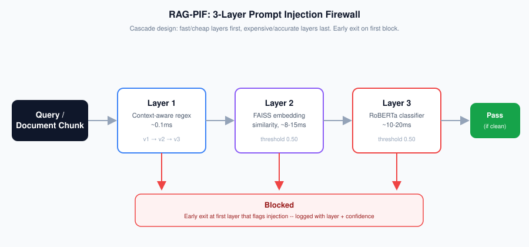

# RAG-PIF: Prompt Injection Firewall for RAG Systems

[](LICENSE)
[](https://www.python.org/)
[](https://huggingface.co/shivateja1253/rag-pif-roberta)
[](https://huggingface.co/datasets/shivateja1253/rag-pif-datasets)

A multi-layer prompt injection firewall for Retrieval-Augmented Generation systems.

## Architecture



- **Layer 1**: Context-aware regex filter (v3) -- fast keyword/pattern matching with
  research/news/fiction context suppression to reduce false positives on benign
  security-discussion text.
- **Layer 2**: Sentence-transformer (`all-MiniLM-L6-v2`) + FAISS embedding classifier,
  threshold 0.50.
- **Layer 3**: Fine-tuned **RoBERTa-base** classifier (switched from DeBERTa-v3 during
  Month 3 due to NaN-gradient issues on Colab's CUDA environment), threshold 0.50.
  [Model on Hugging Face](https://huggingface.co/shivateja1253/rag-pif-roberta).

All three layers cascade (L1 -> L2 -> L3, early exit on first block) via
`streamlit/rag_firewall.py`, and are integrated end-to-end in the Streamlit demo.

## Demo

<!-- TODO: replace with demo GIF -- benign query -> blocked injection ->
     research-framed text correctly passing -> leetspeak caught by Layer 3.
      -->

_GIF coming soon._

## Quick start
```
pip install -r requirements.txt
streamlit run streamlit/Home.py
```
The Layer 3 model downloads automatically from Hugging Face on first run
(`RobertaForSequenceClassification.from_pretrained("shivateja1253/rag-pif-roberta")`).

## Final evaluation (Month 3, full pipeline, held-out test sets)

| Test set | F1 | FPR | Detection rate | n |
|---|---|---|---|---|
| Standard | 0.996 | 0.008 | 1.00 | 263 |
| Evasion (obfuscated/unicode/zero-width) | -- | 0.000 | 1.00 | 150 |
| Adversarial (benign security-research text) | -- | 0.280 | -- | 200 |
| OOD (enterprise emails/support tickets) | -- | 0.053 | -- | 170 |

Full per-layer breakdown and reproducibility metadata (checkpoint timestamps, test-file
hashes) in `evaluation/FINAL_benchmark_results.csv`. Regenerate with
`evaluation/scripts/final_benchmark.py`.

### Known limitations
- Layer 1's journalism-style context prefixes ("news:", "report:", "breaking:") are a
  real precision/security tradeoff -- an attacker could in principle prepend such a
  prefix to try to slip a real injection past Layer 1 specifically. Layers 2 and 3
  remain as backstops.
- Layer 3 generalizes well to character-substitution evasion (e.g. leetspeak) but
  inconsistently to informal/abbreviated semantic paraphrasing with no recognizable
  trigger words (e.g. "kindly disregrd earlier guidance").
- Two targeted retraining experiments to reduce Layer 3's remaining adversarial false
  positives were tried and both underperformed the production checkpoint on at least
  one metric -- see `evaluation/v3_benchmark_results.csv` and
  `evaluation/v4_benchmark_results.csv`, and the
  [model card](https://huggingface.co/shivateja1253/rag-pif-roberta) for the full
  comparison table. This suggests the remaining false positives reflect a genuine
  precision/generalization tradeoff rather than a simple data-coverage gap.

## Repository structure
```
rag-pif/
├── streamlit/              # Demo application (3-layer firewall integrated)
│   ├── Home.py
│   ├── layer1_filter.py    # Layer 1: context-aware regex (v3)
│   ├── layer2_embedding.py # Layer 2: FAISS embedding similarity
│   ├── rag_firewall.py     # Full L1->L2->L3 cascade module
│   └── pages/
│       ├── 1_Chatbot.py
│       └── 2_Dashboard.py
├── models/                 # MODEL_CARD.md -- full checkpoint hosted on Hugging Face
├── datasets/
│   ├── samples/             # Small (20-row) samples of each dataset
│   ├── DATASET_CARD.md      # Full datasets hosted on Hugging Face
│   └── injection_index.faiss
├── evaluation/
│   ├── FINAL_benchmark_results.csv   # Production checkpoint (v2)
│   ├── v3_benchmark_results.csv      # Experimental checkpoint
│   ├── v4_benchmark_results.csv      # Experimental checkpoint
│   └── scripts/final_benchmark.py    # Reproduce these results
├── paper/
├── figures/
├── LICENSE
└── CITATION.cff
```

## Citation
If you use this work, please cite it -- see [CITATION.cff](CITATION.cff).

## Target: IEEE Access
